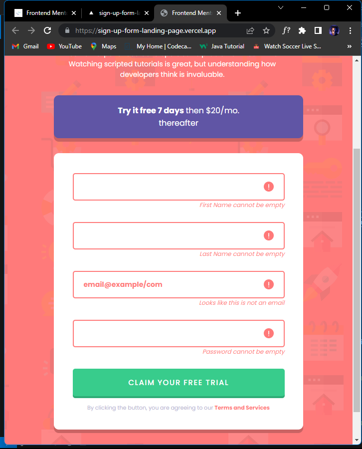

# Frontend Mentor - Intro component with sign up form solution

This is a solution to the [Intro component with sign up form challenge on Frontend Mentor](https://www.frontendmentor.io/challenges/intro-component-with-signup-form-5cf91bd49edda32581d28fd1). Frontend Mentor challenges help you improve your coding skills by building realistic projects.

## Table of contents

- [Screenshot](#screenshot)
- [Links](#links)

- [My process](#my-process)
  - [Built with](#built-with)
- [Author](#author)

## screenshot

## Links

- Solution URL: [Solution's URL](https://github.com/walidshaba/sign-up-form-landing-page)
- Live Site URL: [Live Site](https://sign-up-form-landing-page.vercel.app/)

## My process

### Built with

- Semantic HTML5 markup
- CSS custom properties
- Flexbox
- Desktop-first flow

## Author

- Website - [My Website](https://musashaba-1490d.web.app/)
- Frontend Mentor - [@walidshaba](https://www.frontendmentor.io/profile/walidshaba)
- Twitter - [@codewithmshaba](https://www.twitter.com/codewithmshaba)
